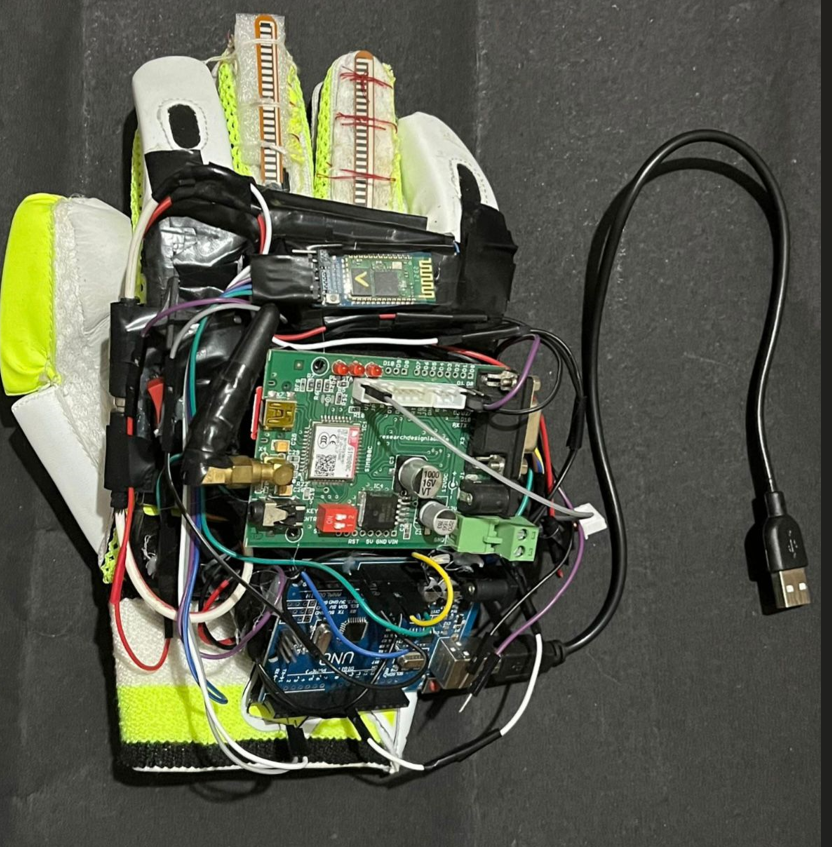

# Prototype-for-Assistive-Hand-Gloves-and-Autonomous-Wheelchair-

  <h1>🧤 Buzzer Hand Glove Cum Location-Based Wheelchair</h1>
  

    An assistive wearable prototype developed as a B.Tech (ECE) project at NIT Silchar. 
    Authors: <b>Akash Sonowal</b> 
  

  

   

  

    

  

---

## 📖 Overview
The **Buzzer Hand Glove** is an assistive device designed for individuals with limited dexterity or mobility impairments.  
It uses **flex sensors**, **Arduino Nano**, **piezoelectric buzzer**, **GSM module (SIM800C)**, and **Bluetooth (HC-05)** to:
- Detect finger bends.
- Provide real-time buzzer feedback.
- Send SMS alerts via GSM.
- Control a Bluetooth-enabled wheelchair for mobility support [oai_citation:0‡16B_HandGlove_Report.pdf](file-service://file-SAX9Ek8dJxcf8rYAQCqQxW).

---

## 🧰 Components
- Arduino Nano  
- Flex Sensors (2.2")  
- Piezoelectric Buzzer  
- GSM Module (SIM800C)  
- Bluetooth Module (HC-05)  
- Power Supply (12V 1200mAh Battery + Charger)  
- Jumper Wires & Prototyping Board [oai_citation:1‡16B_HandGlove_Report.pdf](file-service://file-SAX9Ek8dJxcf8rYAQCqQxW)

---

## ⚙️ Working Principle
1. **Flex Sensor** detects finger bending (resistance changes).  
2. **Arduino Nano** processes the signal.  
3. **Buzzer** alerts immediately on bend detection.  
4. **Triple Buzz** → sends SMS via GSM + Bluetooth signal to wheelchair.  

---

## 🖥️ Simulation & Hardware
- **Tinkercad & Proteus** were used for simulation before hardware testing.  
- Final prototype successfully delivered **buzzer alerts, SMS messages, and wheelchair control** [oai_citation:2‡16B_HandGlove_Report.pdf](file-service://file-SAX9Ek8dJxcf8rYAQCqQxW).

---

## 📌 Conclusion
This project demonstrates how Arduino-based assistive wearables can **enhance independence, safety, and mobility** for disabled and elderly individuals. It is a proof-of-concept for future smart healthcare wearables.

---

